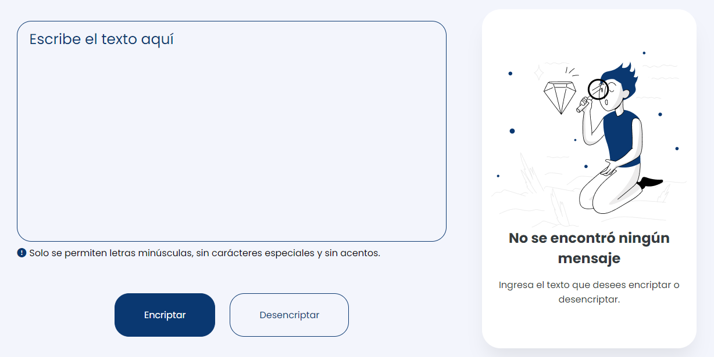

<div align="center">
  
  
  
  
  
  
  
  
  
  
  
  
  
  
  
  
  
  
  

  <h2 align="center">Encripta y desencripta cualquier texto en línea de manera fácil y rápida.</h2>

  Diseño responsivo para todos los dispositivos, creado con HTML, CSS y JavaScript.

  <a href="https://iamjosuefischer.github.io/encriptador-de-texto/"><strong>➥ Demostración del proyecto en línea</strong></a>
  
### 📸 Captura de pantalla de demostración
  
</div>



<br/>

### 🗝️ Llaves de encriptación

- La letra "a" es convertida a "ai".
- La letra "e" es convertida a "enter".
- La letra "i" es convertida a "imes".
- La letra "o" es convertida a "ober".
- La letra "u" es convertida a "ufat".

### ⭐ Prerequisítos

Antes de comenzar, asegúrate de haber cumplido con los siguientes requisitos:

* [Git](https://git-scm.com/downloads "Descargar Git") debe estar instalado en su sistema operativo.

### 🚀 Ejecutar el proyecto localmente

Para ejecutar el **Encriptador de texto** localmente, ejecuta este comando en tu git bash o terminal:

Linux y macOS:

```bash
sudo git clone https://github.com/iamjosuefischer/encriptador-de-texto.git
```

Windows:

```bash
git clone https://github.com/iamjosuefischer/encriptador-de-texto.git
```

### 📫 Contácto

Si quieres contactárme puedes escribirme en [email](mailto:josuefischercraft@gmail.com).

### 📃 Licencia

Este proyecto contiene una licencia: **MIT License**.